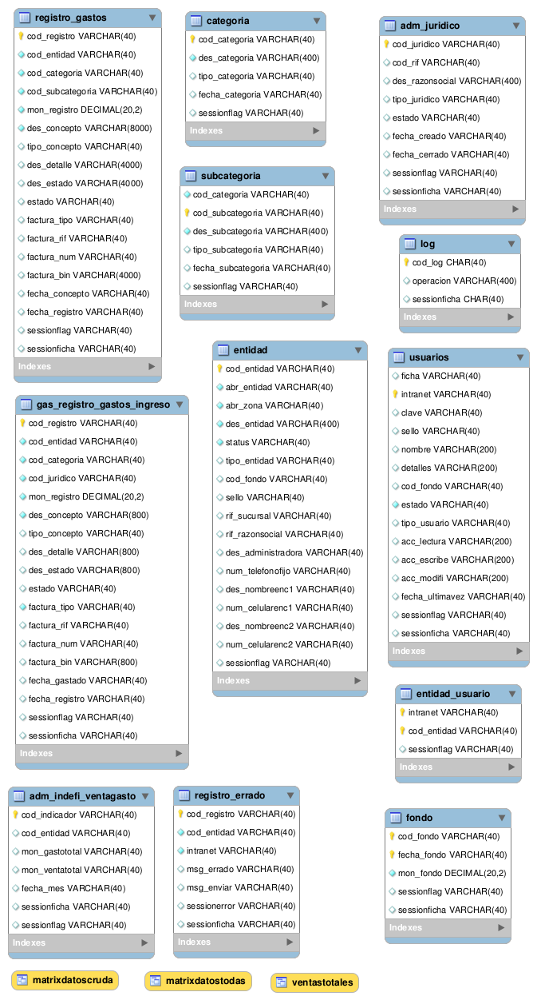

README base de datos "elgasto"
===========================

El proyecto usa varias bases de datos, pero se conecta a tres DBMS unicamente:

* COURIER : empleando o sockets o SMTP por SSL/TLS
* MYSQL/MARIADB: empleando las db `elgastodb`
* SYBASE: empleando las db `OP_001035` como db opcional para indicadores

De estas solo la de gastos es altamente usada, las restante son solo de apoyo en datos.
El proyecto usa dos tipos de acceso, **ODBC** y **MySQL** en el php o en gambas.

En el directorio [elgastodb](elgastodb) esta el archivo `elgastodb.sql` cargar 
esto en el servidor localhost de la maquina instalado en "localhost" y especificar o 
corregir la conexcion en el archivo `elgastoweb/config/database.php` del grupo correspondiente "elgastodb".
En el mismo archivo esta ya el string DNS especificado de OASIS, certificar y corregir.

A continuacion se especifica cada uno de estos componentes.

### Configuracion MySQL

Se instala PerconaDB, MariaDB o MySQL pero abierto a toda ip y con el puerto abierto a todos, 
en produccion se instala con el puerto solo disponible para `127.0.0.1` y 
adicional se configura para no usar DNS y con iptables se cierra a los hosts, 
**CUIDADO** se asume Percoan/MariDB/MySQL  entre 5.0 y hasta 5.7 solamente.

```
sed -i -e 's/skip-external-locking/skip-external-locking\nlocal-infile=0/g' /etc/mysql/my.cnf
sed -i -e 's/skip-external-locking/skip-external-locking\nskip-name-resolve/g' /etc/mysql/my.cnf
sed -i 's/bind-address.*=.*/bind-address=0.0.0.0/g' /etc/mysql/my.cnf
iptables -I INPUT -p tcp -s 0.0.0.0/0 --dport 3306 -j DROP
iptables -I INPUT -p udp -s 0.0.0.0/0 --dport 3306 -j DROP
iptables -I INPUT -p tcp -s 45.181.69.122 --dport 3306 -j ACCEPT
iptables -I INPUT -p tcp -s 127.0.0.1 --dport 3306 -j ACCEPT
iptables -I INPUT -p tcp -s localhost --dport 3306 -j ACCEPT
iptables -I INPUT -p tcp -s ruices.tijerazo.net --dport 3306 -j ACCEPT
iptables -I INPUT -p tcp -s 37.10.252.253 --dport 3306 -j ACCEPT
iptables -I INPUT -p tcp -s 10.10.34.30 --dport 3306 -j ACCEPT
```

El iptables es sensible al orden, ordenes DROP se ejecutan/van primero que las ACCEPT, cuidado!
**solo use iptables en produccion, OJO!**, el usuario es `elgasto`, y no puede crear esquemas, 
por ende deben existir siempre, al recrear o trabajar en desarrollo, la clave esta definica 
en el passmanager o en el proyecto.

``` sql
CREATE USER 'elgasto'@'%' IDENTIFIED BY 'elgasto.clave.secreta';
CREATE DATABASE IF NOT EXISTS `elgastodb` ;
GRANT ALL PRIVILEGES ON elgastodb.* TO 'elgasto'@'%' IDENTIFIED BY 'elgasto.clave.secreta' ;
```

Esto se puede ejecutar en la consola del servidor remoto asi:

```
mysql -h 127.0.0.1 -u root -p -e "CREATE DATABASE IF NOT EXISTS elgastodb;"
```

obviamente esa solo fue una de las cuatro sentencias, todas deben ejecutarse arriba.

### Configuracion y ODBC

Para configurar el acceso ODBC se requiere previa preparacion, 
leer [odbc-README.md](odbc-README.md) en donde se cubre los aspectos teoricos 
para que comprenda las siguientes lineas.

### Base de datos externas para indicadores de ventas vs gastos

En la base de datos `OP_001037` usada como ejemplo se preparan **tablas proxy de 
la db `elgastodb` para portabilidad.**

Las tablas proxy son conexciones directas desde Sybase hacia otras bases de datos, 
en donde se puede usar directamente tablas externas desde esa otra base de datos.
La configuracion de estas se cubre en [sybase-README.md](sybase-README.md#tablas-proxy)

Esto es una idea preliminar, de no contar con la feature de tablas proxy, 
emplear entonces conexciones ODBC con OpenVPN. Sea como sea se necesita 
algun metodo de acceso directo o ejecutar un webservice, si no se cuenta 
con un API del lado del servidor remoto.

Se definira las columnas y tablas de este sistema, recomendable crear del lado 
de este sistema un "cubo" de datos, volcar el resultado final mensual alli 
y asi se podra emplear mejor las consultas.

### Diseño de la DB y diccionario de datos

El diseño de la db es solo, `elgastodb` el **resto es tomado desde la db OASIS y elpersonaldb**.

* **elgasto** su diseño no es amplio solo accesos de usuarios y de alcances, ya que este proyecto 
lo que realiza es consultas y reportes a otras bases de datos. Se puede visualizar en 
el archivo [elgastodb.mwb](elgastodb.mwb) de `Mysql-workbench` el script SQL generado 
esta en el archivo `elgastodb.sql`.

Toda nueva tabla o implementacion debe estar en la db `elgasto`, y su nombre debe ser siempre
con prefijo `gas_` seguido de nombre en formato `<modulo><tabla>` donde modulo es el nombre del 
directorio controlador y tabla el nombre de la tabla que se usara.

**Todo cambio debe reflejarse primero en el diseño y despues de alli generarse los scripts sql.**



